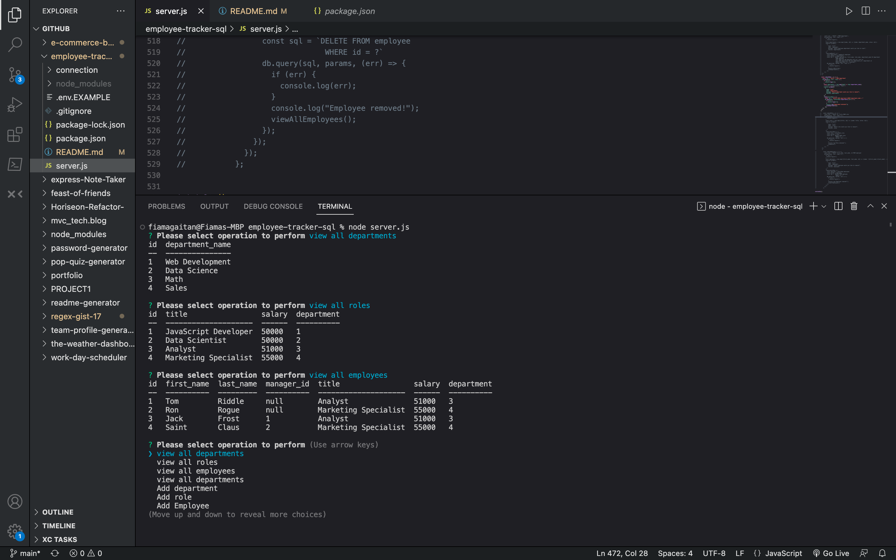

# <employee-tracker-sql>

## Description

The motivation for this project was to create a database for a company that shows employees working there, the departments of the company, the role of the employees, and the managers.

This project was built to be able to successfully create a schema and seed a database that was created with no code that will generate an employee database and will have functionality that works .

This project solves how to successfully build a database and it really reinforces the different ways to use functionality while actively showing how the data is being received and sent out. 

- What did you learn?
This project was particularly challenging for me because the data acts in different ways with essentially the same functionality, so in order to see that I had to rely on console,logs and see not only what was being fetched but how it was being transcribed. That was very helpful to understand what was happening although time consuming, it was a great learning curve.

## Table of Contents 

If your README is long, add a table of contents to make it easy for users to find what they need.

- [Installation](#installation)
- [Usage](#usage)
- [Credits](#credits)
- [License](#license)

## Installation

To install this project clone the repository from Github.

In the package.json we are using inquires, mysql2, and console.table for the data to be assorted in tables once created and assigned.
Run a `npm install` from the terminal to get node working from the server.js file.

## Usage

Run an "node server.js" command from the terminal to start running node.

The following link is a video showing the functioanlity live from the terminal.
https://drive.google.com/file/d/1eMPIrivY9mYmGaTwTYNKWJ7DwR13x7vO/view

## Credits

- Calendly tutor
- Classroom help

GitHub Repo:
https://github.com/flgaitan/employee-tracker-sql

## License

- MIT 🏆

---

🏆 

## Features
Currently , this database is able to remove a department.

## Tests

This application is currently still under test for full functionality.
